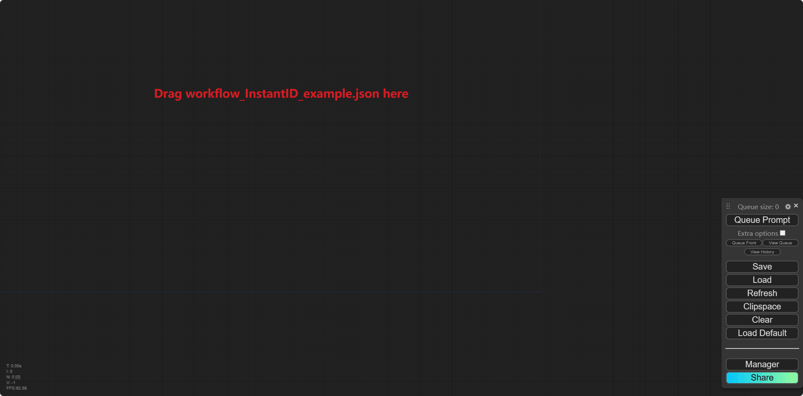
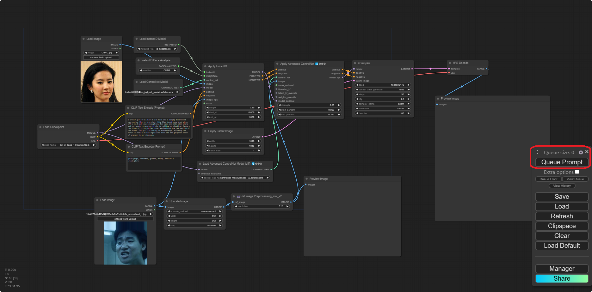

# Comfy_Preprocess_Haruhi

Native [Comfy_Preprocess_Haruhi](https://github.com/hhhwmws0117/Comfy_Preprocess_Haruhi) support for [ComfyUI](https://github.com/comfyanonymous/ComfyUI).

**For InstantID**

This extension differs from the many already available as it doesn't use *diffusers* but instead implements InstantID natively and it fully integrates with ComfyUI.

## Important updates

- **2024/03/25** 完成了第二版的controlnet预处理节点，可以直接在ComfyUI中使用
  
- **2024/03/16:** 上传了第一版controlnet预处理节点

## GIF Tutorial

## 安装

**Upgrade ComfyUI to the latest version!**

**Remember at the moment this is only for SDXL.**

1. 下载 或者 使用`git clone` 本文件夹或者 [Comfy_Preprocess_Haruhi](https://github.com/hhhwmws0117/Comfy_Preprocess_Haruhi) 到 `ComfyUI/custom_nodes/` 目录下 或者 使用**ComfyUI Manager**.

2. 请将[silk-road/Haruhi-expression-controlnet-v3-xl](https://huggingface.co/silk-road/Haruhi-expression-controlnet-v3-xl/tree/main)下的controlnet模型下载到`ComfyUI/models/controlnet`目录下。

3. 本项目代码部分参考[Fannovel16/comfyui_controlnet_aux](https://github.com/Fannovel16/comfyui_controlnet_aux)，并使用新版的controlnet加载方法，请一并安装。

4. 工作流中名字中带有InstantID前缀的将依赖InstantID节点，所以请确保已经安装InstantID节点。参考教程：

   - [cubiq/ComfyUI_InstantID](https://github.com/cubiq/ComfyUI_InstantID)
   - [ZHO-ZHO-ZHO/ComfyUI-InstantID](https://github.com/ZHO-ZHO-ZHO/ComfyUI-InstantID)

   InstantID requires `insightface`, you need to add it to your libraries together with `onnxruntime` and `onnxruntime-gpu`.

   The InsightFace model is **antelopev2** (not the classic buffalo_l). Download the models (for example from [here](https://drive.google.com/file/d/18wEUfMNohBJ4K3Ly5wpTejPfDzp-8fI8/view?usp=sharing) or [here](https://huggingface.co/MonsterMMORPG/tools/tree/main)), unzip and place them in the `ComfyUI/models/insightface/models/antelopev2` directory.

   The **main model** can be downloaded from [HuggingFace](https://huggingface.co/InstantX/InstantID/resolve/main/ip-adapter.bin?download=true) and should be placed into the `ComfyUI/models/instantid` directory. (Note that the model is called *ip_adapter* as it is based on the [IPAdapter](https://github.com/tencent-ailab/IP-Adapter)).

   You also needs a [controlnet](https://huggingface.co/InstantX/InstantID/resolve/main/ControlNetModel/diffusion_pytorch_model.safetensors?download=true), place it in the ComfyUI controlnet directory.
## 基础使用
如果你想使用**Haruhi preprocesser**节点搭建自己的工作流，节点在node的**ControlPreprocessHaruhi**目录下，共有四种preprocesser节点：
- **📷Ref Image Preprocessing_mix_v1**
    - 第一版搭建的controlnet预处理模块，基于基本的openpose和未经mask的lineart进行叠加
    - 对应的controlnet模型为[controlnet_face-v2-XL](https://huggingface.co/silk-road/Haruhi-expression-controlnet-v2-xl/blob/main/controlnet_face-v2-XL.safetensors)
- **📷Ref Image Preprocessing_facepose_v2**
    - 第二版搭建的controlnet预处理模块，基于自定义的openpose关键点进行连线并上色——facepose
    - 对应的controlnet模型为 [controlnet_colored_v3](https://huggingface.co/silk-road/Haruhi-expression-controlnet-v3-xl/blob/main/controlnet_colored_v3.safetensors)
- **📷Ref Image Preprocessing_maskedlineart_v2**
    - 第二版搭建的controlnet预处理模块，基于对内脸切分进行mask的lineart
    - 对应的controlnet模型为[controlnet_meshBlended_v3](https://huggingface.co/silk-road/Haruhi-expression-controlnet-v3-xl/blob/main/controlnet_meshBlended_v3.safetensors)
- **📷Ref Image Preprocessing_mix_v2**
    - 第二版搭建的controlnet预处理模块，基于自定义的facepose和masked lineart进行叠加
    - 对应的controlnet模型为[controlnet_meshedLSD_v3](https://huggingface.co/silk-road/Haruhi-expression-controlnet-v3-xl/blob/main/controlnet_meshedLSD_v3.safetensors)

请使用Load Advanced ControlNet Model(diff)进行加载，选择对应的controlnet模型即可，基模型为[sd_xl_base_1.0.safetensors](https://huggingface.co/Zedge/sdxl-base/blob/main/sd_xl_base_1.0.safetensors)，可参考示例工作流。

## Basic Workflow

在 `WORKFLOWS` 目录下有测试通过的一些基本工作流

## ControlNet Model

本项目共训练了三个批次的controlnet模型，均基于Celeb数据集以及一些公开可爬取的网络数据进行训练：
- [silk-road/Haruhi-expression-controlnet-v1-xl](https://huggingface.co/silk-road/Haruhi-expression-controlnet-v1-xl)
  - 本批次旨在跑通controlnet训练的baseline，基于基础openpose
- [silk-road/Haruhi-expression-controlnet-v2-xl](https://huggingface.co/silk-road/Haruhi-expression-controlnet-v2-xl)
  - 本批次旨在探索openpose和lineart联合表征表情和ID的可能性，观测到虚影现象的产生
- [silk-road/Haruhi-expression-controlnet-v3-xl](https://huggingface.co/silk-road/Haruhi-expression-controlnet-v3-xl)
  - 本批次旨在解决虚影现象的产生以及提升openpose信息对于表情的影响能力和降低lineart对于id信息的影响能力，取得了较好的效果

## 已知问题
### 水印

训练数据中充满了水印，为避免水印出现在生成的数据中，请使用与 1024×1024 稍微不同的分辨率（或标准分辨率），例如**1016×1016**，效果相当不错，或者尝试在negative prompt中加入一些提示词，可能的水印来源getty images。

